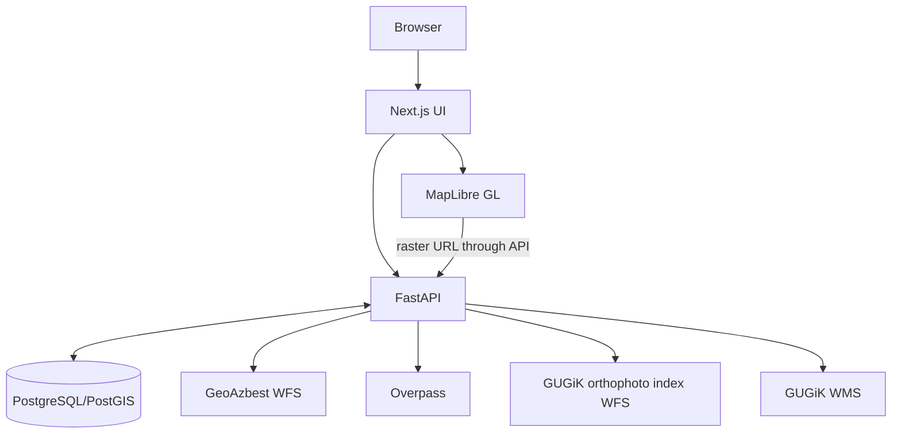

# Architecture diagram

```mermaid
flowchart TB
  Browser[Browser]
  Next[Next.js UI]
  Map[MapLibre GL]
  Api[FastAPI]
  Db[(PostgreSQL/PostGIS)]
  Wfs[GeoAzbest WFS]
  Overpass[Overpass]
  GIndex[GUGiK orthophoto index WFS]
  GWms[GUGiK WMS]
  Browser --> Next
  Next --> Map
  Next --> Api
  Api <--> Db
  Api --> Wfs
  Api --> Overpass
  Api --> GIndex
  Api --> GWms
  Map -->|raster URL through API| Api
```
