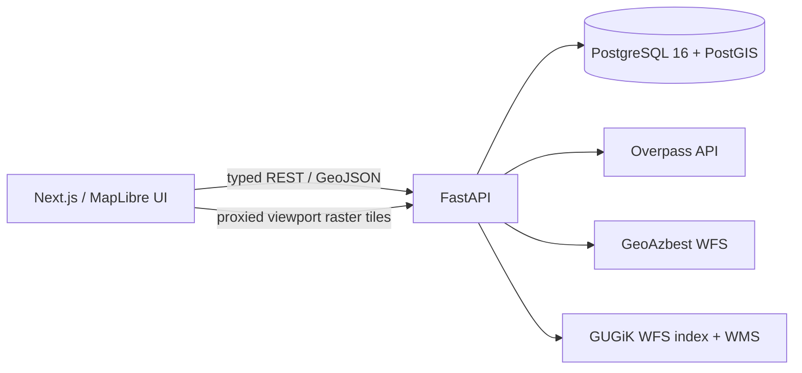
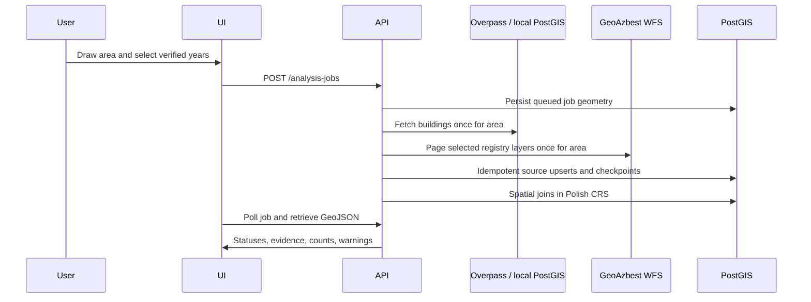

# Architecture

## Components

The frontend is TypeScript with strict mode, MapLibre GL JS, TanStack Query, Tailwind CSS, keyboard-focusable controls, and a full-screen map. It never reads WMS colors for registry status. FastAPI is the source of the OpenAPI contract (`/api/v1/openapi.json`); the small typed client in `frontend/lib/api.ts` mirrors the required response shapes.

The backend uses SQLAlchemy/GeoAlchemy with native PostGIS geometries in EPSG:4326 for storage and delivery. It transforms to EPSG:2180 with PyProj for every area, intersection, and overlap calculation. No polygon is persisted as a JSON substitute for a spatial type.

## Data flow

## Status semantics

| UI color | API status | Meaning |
| --- | --- | --- |
| red | `listed` | A matching `budynki_z_azbestem` or unresolved listed parcel record exists. |
| teal | `cleaned` | A matching cleaned/removal record exists. It is not an all-material or roof guarantee. |
| gray outline | `not_listed` | OSM building has no matching available registry record. |
| purple | `ambiguous` | Conflicting listed/cleaned evidence or competing spatial matches. |
| gray | `unknown` | The source was unavailable or no trustworthy determination could be made. |

Orange is reserved in the model/API design but no orange layer or prediction is emitted until a real model is configured.

## API

| Endpoint | Purpose |
| --- | --- |
| `POST /api/v1/analysis-jobs` | Queue an area analysis. |
| `GET /api/v1/analysis-jobs/{id}` | Job progress and source failures. |
| `GET /api/v1/analysis-jobs/{id}/buildings` | Filtered GeoJSON results. |
| `GET /api/v1/buildings/{id}` | Building evidence, matching metrics, warnings. |
| `GET /api/v1/imagery/available` | Years verified against the official coverage index. |
| `GET /api/v1/imagery/tiles/{layer}/{z}/{x}/{y}.jpg` | Server-proxied GUGiK WMS viewport tiles. |
| `POST /api/v1/registry/sync` | Resumable WFS sync by layer, bbox, TERYT, or country scope. |
| `GET /api/v1/registry/sync/{id}` | Synchronization checkpoint progress for polling clients. |
| `GET /api/v1/analysis-jobs/{id}/statistics` | Area totals. |
| `GET /api/v1/analysis-jobs/{id}/export` | GeoJSON or CSV export. |
| `PUT /api/v1/matches/{id}/review` | Persist manual review state. |

`AnalysisJobBuilding` makes result status source-specific to a job. This prevents a later failed source request from becoming a global negative claim about an existing building.

## Reliability and performance

- WFS pages use `startIndex` and `count`, resumable `RegistrySyncCheckpoint` rows, exponential retry, idempotent upserts, and raw source-property retention.
- One registry request scope is shared across an analyzed area; the app never requests GeoAzbest independently per building.
- OSM and imagery services have timeouts and controlled imagery-index concurrency.
- External failure is stored in `AnalysisJob.errors` and delivered as `source_unavailable` / `unknown`, never converted into `not_listed`.
- Raster imagery is proxied for the selected viewport with cache headers. The app does not bulk-download imagery.
- The data model includes `ModelPrediction` and a no-op `RoofPredictionProvider`, but there is no trained model or synthetic score.
