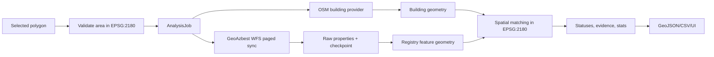

# Data-flow diagram

```mermaid
flowchart LR
  A[Selected polygon] --> B[Validate area in EPSG:2180]
  B --> C[AnalysisJob]
  C --> D[OSM building provider]
  C --> E[GeoAzbest WFS paged sync]
  E --> F[Raw properties + checkpoint]
  D --> G[Building geometry]
  F --> H[Registry feature geometry]
  G --> I[Spatial matching in EPSG:2180]
  H --> I
  I --> J[Statuses, evidence, stats]
  J --> K[GeoJSON/CSV/UI]
```
